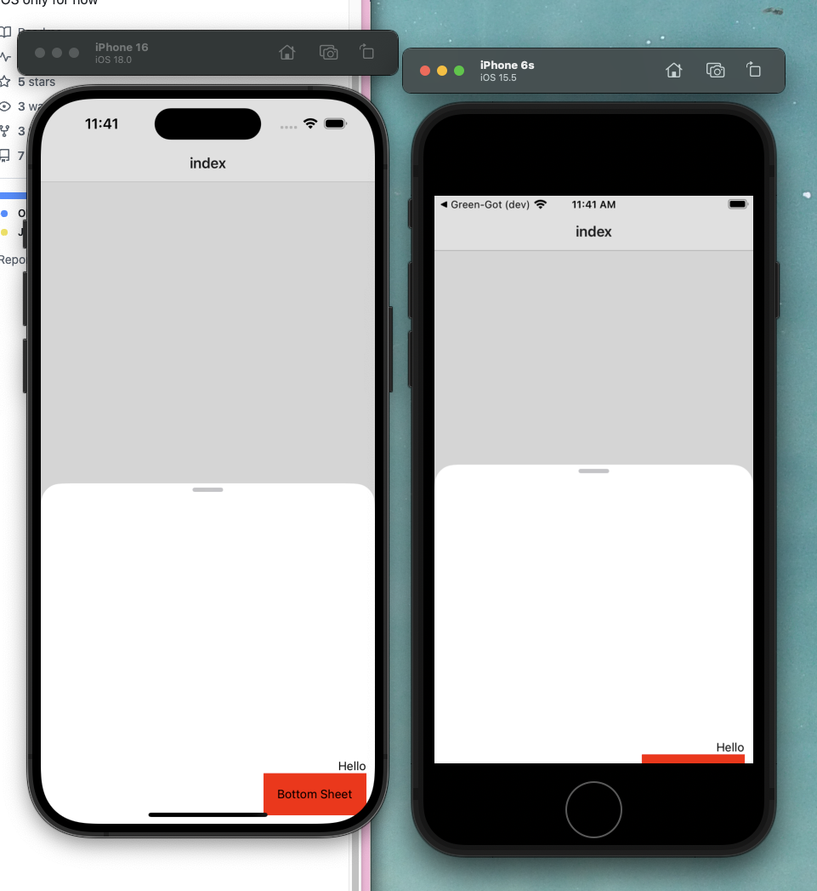

# Welcome to your Expo app 👋

This is an [Expo](https://expo.dev) project created with [`create-expo-app`](https://www.npmjs.com/package/create-expo-app).

## Get started

1. Install dependencies

   ```bash
   bun install
   ```

2. Start the app

   ```bash
    bun ios
   ```

3. Open sheet on an iphone 6s and any more recent iphone

you can see the sheet on iphone 6s being too small and stuck at the bottom. (cf. screenshot)


